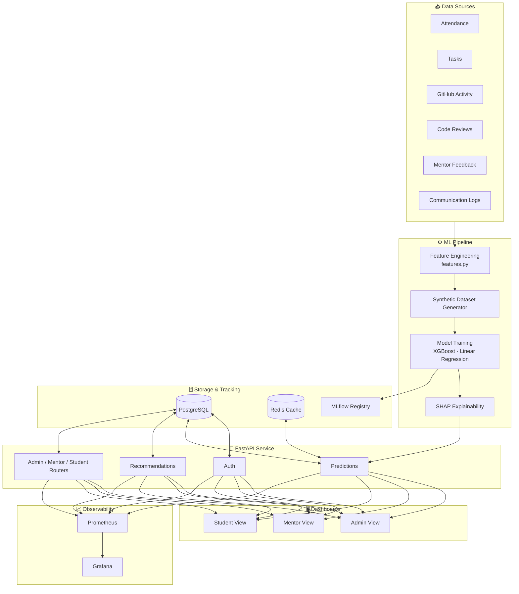
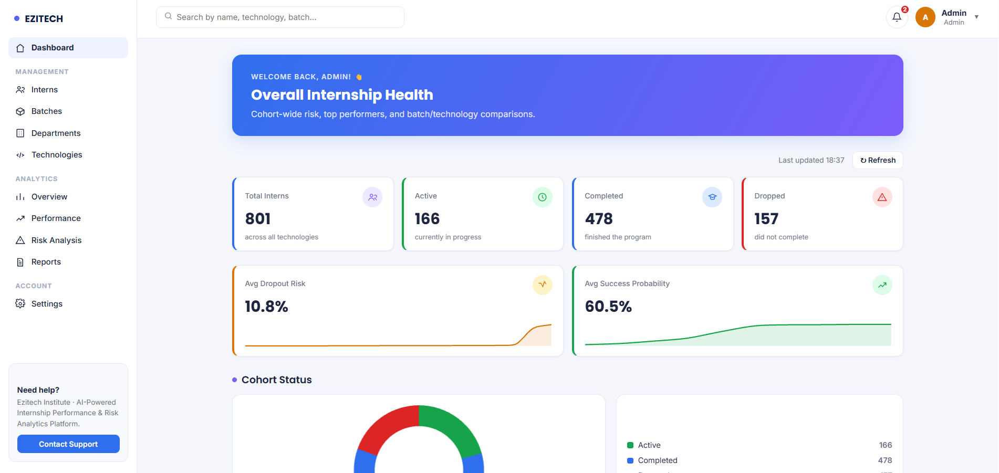
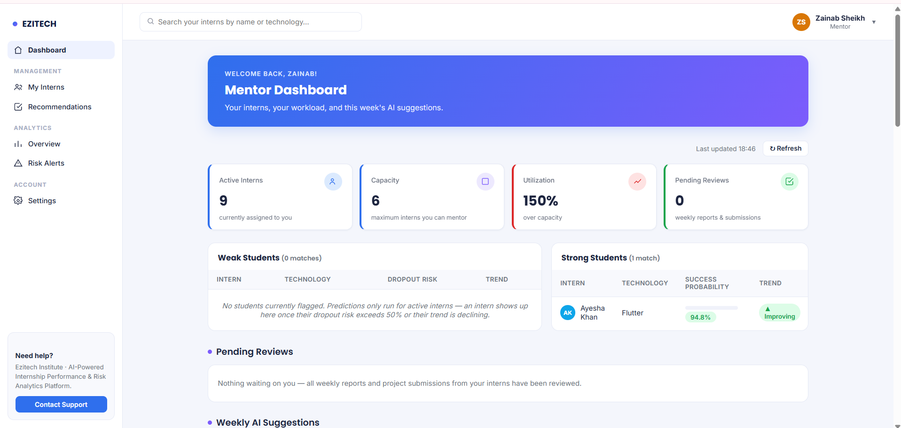
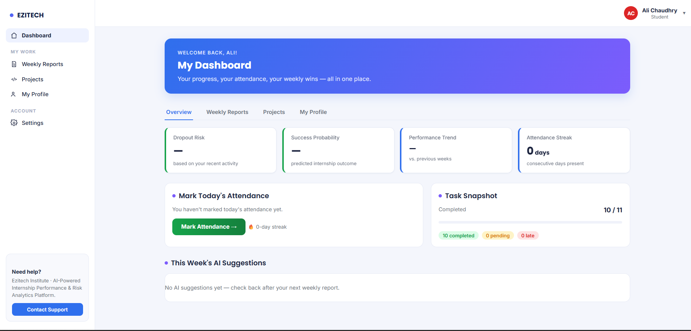

<div align="center">

# 🎯 Internship Performance Prediction & Risk Analytics Platform

### AI-powered early-warning system for internship programs — predicts dropout risk, tracks performance trends, and recommends interventions before problems happen.

**Ezitech Engineering Framework · Industry AI Case Study AI-005**

[](https://www.python.org/)
[](https://fastapi.tiangolo.com/)
[](https://xgboost.readthedocs.io/)
[](https://www.postgresql.org/)
[](https://www.docker.com/)

[](LICENSE)
[](https://streamlit.io/)
[](https://shap.readthedocs.io/)
[](https://mlflow.org/)

[Overview](#-overview) • [Features](#-features) • [Architecture](#-architecture) • [Model Performance](#-model-performance) • [Setup](#-setup) • [API](#-api-reference) • [Screenshots](#-screenshots)

</div>

---

## 📌 Overview

Ezitech runs internship batches across **Laravel, MERN Stack, AI, Flutter, UI/UX, and DevOps**. Manually monitoring hundreds of interns to spot who's struggling — before they drop out — doesn't scale.

This platform replaces manual monitoring with a continuously-learning analytics engine that ingests attendance, task, GitHub, code review, and mentor-feedback data, and turns it into:

- **Early dropout warnings**, weeks before a mentor would notice manually
- **Performance trend classification** (declining / stable / improving)
- **Explainable predictions** — every score comes with *why*, via SHAP
- **Actionable, rule-based recommendations** tied directly to model outputs
- **Role-based dashboards** for Admins, Mentors, and Students

Built end-to-end: synthetic data generation → feature engineering → model training → explainability → REST API → dashboards → monitoring.

---

## ✨ Features

| Category | What's included |
|---|---|
| 🔮 **Predictions** | Dropout risk, performance trend, success probability, learning speed & skill growth, completion probability, project success probability, mentor workload |
| 🧠 **Explainable AI** | Per-prediction SHAP feature attributions — "why was this intern flagged?" not just a number |
| 💡 **Recommendations** | Rule-based engine layered on real model outputs: mentor intervention, easier/advanced tasks, extra learning resources, weekly goals |
| 📊 **Dashboards** | Admin (batch health, top performers, department analytics), Mentor (weak/strong students, pending reviews, risk alerts), Student (own score, skill progress, AI guidance) — shipped as **both** a native web UI and a Streamlit app |
| 🔐 **Auth** | Role-based login (Admin / Mentor / Student) with hashed passwords and JWT-style session handling |
| 🛰️ **Monitoring** | Prometheus metrics + Grafana dashboards + MLflow experiment tracking, all containerized |
| 🔁 **Batch Scoring** | Scheduled/on-demand batch prediction runner so dashboards read from a `predictions` table instead of calling models live |

---

## 🏗️ Architecture



---

## 📈 Model Performance

Four models cover all 8 required predictions (the remaining 3 — completion probability, project success probability, mentor workload — are derived mathematically/via SQL rather than separately trained).

| Model | Type | Accuracy | ROC-AUC | Notes |
|---|---|:---:|:---:|---|
| **Dropout Risk** | XGBoost (binary) | 85.1% | 0.842 | Precision 75% / Recall 60% @ threshold 0.45 |
| **Performance Trend** | XGBoost (3-class) | 83.4% | — | Macro F1 83.4% — declining / stable / improving |
| **Success Probability** | XGBoost (binary) | 90.5% | 0.947 | Precision 92.9% / Recall 81.2% @ threshold 0.60 |
| **Learning Speed & Skill Growth** | Linear Regression | R² 0.594 / 0.023 | — | Early-period trend regression |

Full metrics, confusion matrices, and training details: [`app/ml/saved_models/model_evaluation_report.md`](app/ml/saved_models/model_evaluation_report.md)

Every prediction returned by the API includes a SHAP-based explanation of its top contributing factors — see [`app/ml/predict.py`](app/ml/predict.py).

---

## 📁 Project Structure

```
intern-analytics-platform/
├── docker-compose.yml        # Postgres, Redis, MLflow, Prometheus, Grafana
├── requirements.txt
├── .env.example
├── sql/
│   ├── schema.sql             # Core schema (auto-loaded on first run)
│   ├── auth_migration.sql
│   ├── mentor_review_migration.sql
│   └── student_features_migration.sql
├── monitoring/
│   └── prometheus.yml
├── scripts/
│   └── seed_users.py          # Seeds demo Admin/Mentor/Student accounts
├── app/
│   ├── main.py                 # FastAPI entrypoint
│   ├── database.py
│   ├── security.py             # Auth / password hashing
│   ├── models/db_models.py     # SQLAlchemy ORM models
│   ├── schemas/schemas.py      # Pydantic request/response models
│   ├── routers/
│   │   ├── auth.py             # /auth        — login, register
│   │   ├── admin.py            # /admin        — batch health, analytics
│   │   ├── mentor.py           # /mentor       — roster, reviews, risk alerts
│   │   ├── students.py         # /students/me  — self-service student API
│   │   ├── interns.py          # /interns      — CRUD
│   │   ├── predictions.py      # /predict      — all 8 predictions
│   │   └── recommendations.py  # /recommendations
│   ├── services/
│   │   └── recommendation_engine.py
│   ├── ml/
│   │   ├── features.py                # Shared feature engineering pipeline
│   │   ├── generate_synthetic_data.py # Synthetic dataset generation
│   │   ├── build_*.py                 # Per-model dataset builders
│   │   ├── train_*.py                 # Per-model training scripts
│   │   ├── predict.py                 # Live prediction + SHAP engine
│   │   ├── batch_predict.py           # Batch scoring runner
│   │   ├── generate_evaluation_report.py
│   │   └── saved_models/              # Trained model artifacts + reports
│   └── static/                        # Native HTML/CSS/JS dashboard
├── dashboard/                          # Streamlit dashboard (alt UI)
│   ├── app.py
│   ├── pages/
│   │   ├── 1_Admin.py
│   │   ├── 2_Mentor.py
│   │   └── 3_Student.py
│   ├── api_client.py
│   └── charts.py
```

---

## 🛠️ Tech Stack

| Layer | Technology |
|---|---|
| API | FastAPI, Pydantic, SQLAlchemy |
| ML | Scikit-learn, XGBoost, SHAP |
| Data | PostgreSQL, Redis |
| Experiment Tracking | MLflow |
| Monitoring | Prometheus, Grafana |
| Dashboards | Streamlit + native HTML/CSS/JS |
| Infra | Docker Compose |

---

## 🚀 Setup

### 1. Start infrastructure
```bash
docker-compose up -d
docker ps   # expect: intern_postgres, intern_redis, intern_mlflow, intern_prometheus, intern_grafana
```

### 2. Python environment
```bash
python -m venv venv
venv\Scripts\activate          # Windows
# source venv/bin/activate     # macOS/Linux
pip install -r requirements.txt
```

### 3. Configure environment
```bash
copy .env.example .env         # Windows
# cp .env.example .env         # macOS/Linux
```

### 4. Unpack trained models
Trained model artifacts ship in `app/ml.zip` (kept out of git as binary blobs). Extract it into `app/ml/` so `saved_models/` contains the `.json`/`.pkl` files before starting the API.

### 5. Run the API
```bash
uvicorn app.main:app --reload
```
- Swagger docs → http://localhost:8000/docs
- Health check → http://localhost:8000/health

### 6. Run the Streamlit dashboard (optional, alt UI)
```bash
streamlit run dashboard/app.py
```

### 7. Access supporting services

| Service | URL | Credentials |
|---|---|---|
| API Docs | http://localhost:8000/docs | — |
| MLflow | http://localhost:5000 | — |
| Prometheus | http://localhost:9090 | — |
| Grafana | http://localhost:3000 | `admin` / `admin123` |
| Postgres | `localhost:5432` | `intern_admin` / `intern_pass123` |

---

## 🔌 API Reference

| Router | Prefix | Purpose |
|---|---|---|
| Auth | `/auth` | Login, register, change password |
| Admin | `/admin` | Batch-wide overview, risk & performance analytics |
| Mentor | `/mentor` | Roster overview, weekly reports, pending reviews, risk alerts |
| Students | `/students/me` | Self-service: profile, tasks, attendance, weekly reports, projects |
| Interns | `/interns` | Intern CRUD |
| Predictions | `/predict` | All 8 required predictions, each with SHAP explanations |
| Recommendations | `/recommendations` | Generate & list AI recommendations per intern |

Full interactive reference (request/response schemas, try-it-out) is auto-generated at `/docs` via Swagger/OpenAPI.

---

## 🖼️ Screenshots

> 📷 *Add screenshots here once you have the app running — this is the single biggest thing missing from making this README "done."*
>
> Suggested shots: **Admin overview**, **Mentor risk alerts**, **Student dashboard**, **Swagger `/docs` page**, one **SHAP explanation panel**.
>
> ```markdown
> | Admin Dashboard | Mentor Risk Alerts | Student View |
> |---|---|---|
> |  |  |  |
> ```
> Drop the images in a `docs/screenshots/` folder and this table renders automatically on GitHub.

---

## 🏆 Bonus Features Implemented

- ✅ Risk Alerts (severity-tiered: critical / high / moderate)
- ✅ Explainable AI Dashboard (SHAP factors surfaced per prediction)
- ✅ Early Dropout Detection (dedicated model + tuned decision threshold)

---

## 📄 License

MIT — see [LICENSE](LICENSE).

---

<div align="center">

Built for **Ezitech Engineering Framework — Case Study AI-005**

</div>
